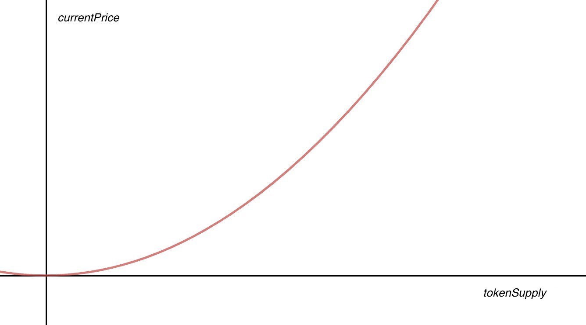
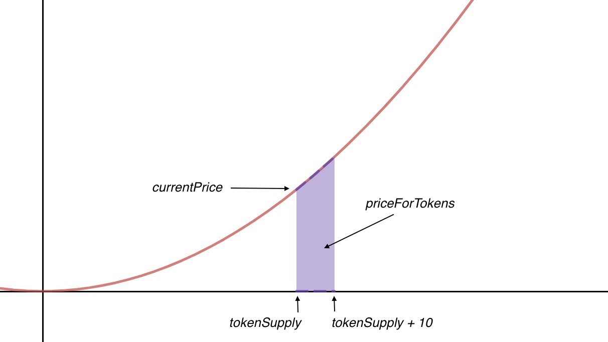
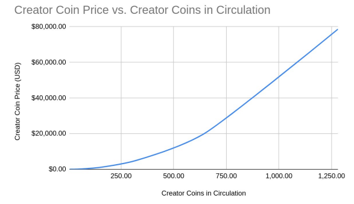
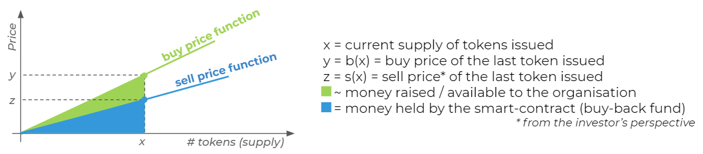
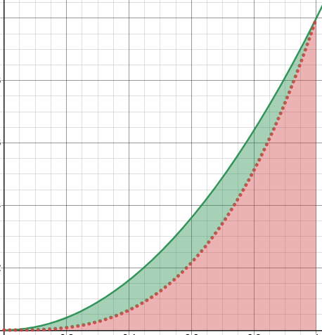
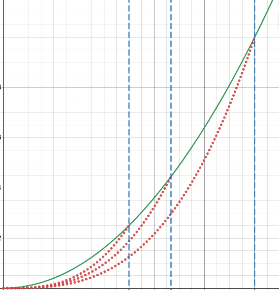
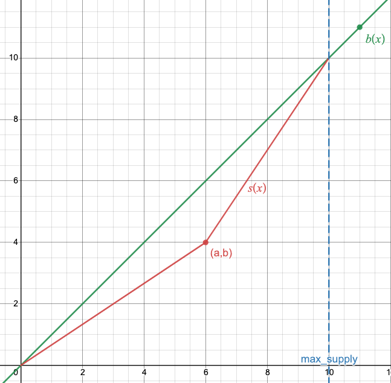

# Creator Token Exchange

## Overview

Creator Token Exchange allows a creator to mint an original token to sell to their fans. The Creator Token Exchange relies on a Dynamic Automated Market Maker to generate revenue for the creator as more tokens are minted, while providing continuous and perpetual liquidity for buyers of the token.

## Background

The Dynamic Automated Market Maker (DAMM) is a novel variation of traditional bonding curve-based [automated market makers](https://www.gemini.com/cryptopedia/amm-what-are-automated-market-makers), allowing for both revenue generation and liquidity provision.

### Bonding Curves

A bonding curve is a function which determines the incremental price of a token as as function of the current supply of that token.

Source: [Yos Riady, *Bonding Curves Explained*](https://yos.io/2018/11/10/bonding-curves/)

By taking the area under this curve, we are able to compute the proceeds required in any given transaction. In the example below, there are tokenSupply tokens in circulation before the transaction, and a user wishes to buy 10 tokens. 

Source: [Yos Riady, *Bonding Curves Explained*](https://yos.io/2018/11/10/bonding-curves/)

Bonding curves offer the advantage of guaranteed liquidity for any number of tokens at any point in time. They have the drawback of greater price slippage than liquid order book-based markets. Crucially, the entire area under the bonding curve acts as a liquidity pool (i.e., none of the area under the curve can be harvested as revenue).

### Existing Applications of Bonding Curves

#### BitClout

BitClout.com is a social media platform which allows users to create and sell their own token (called Creator Coins). The transaction flow requires users to buy the BitClout currency using bitcoin, and then to buy and sell Creator Coins for BitClout. This enables the BitClout.com organization to generate by revenue by minting BitClout, since the structure of the bonding curve prevents them from earning revenue on transactions along the bonding curve.

It is worth noting that the price of BitClout is also determined by a bonding curve-like function -- BitClout.com simply does not provide liquidity on the BitClout currency, allowing them to crystallize all proceeds from the sale of BitClout currency as profit.

The chief drawback is the use of BitClout as an intermediary currency, and the illusion of liquidity in Creator Coins. When a user wishes to sell Creator Coins at a profit, he receives BitClout in exchange. He then needs to sell his BitClout off-platform (often on Discord) at as much as a 40% discount.

Source: [*BitClout White Paper*](https://bitcloutwhitepaper.com/)

#### Continuous Organizations

The Continuous Organizations approach, described in the [*Continuous Organizations Whitepaper*](https://github.com/C-ORG/whitepaper/) uses bonding curves as a fundraising mechanism forn organization. The key innovation is to have two separate bonding curves: one along which a user can buy tokens, and one along which a user can sell tokens:

Source: [*Continuous Organizations Whitepaper*](https://github.com/C-ORG/whitepaper/)

While this provides a way for the organization to raise money, the mechanism loses the continuous liquidity for both buys and sales provided by the traditional bonding curve. This is fine for the Continuous Organizations use case, where the objective is fundraising, and liqudity provision can be left to other secondary market exchanges.

## Dynamic Automated Market Maker

### Motivation

The drawbacks of the BitClout.com and Continuous Organizations use of bonding curves motivates a new mechanism which both:
1. Provides constant liquidity for a token, and
2. Generates extractable revenue for the issuer of the token

### Mechanism

We achieve this using the Dynamic Automated Market Maker, which uses a continuous bonding curve to guarantee continuous liquidity provision, but relies on separate buy and sale price functions so that a portion of the liquidity pool can be harvested as profit.

Mechanically, users buy tokens along the buy price function *b(x)* as long as the number of tokens outstanding is equal to the peak number of tokens in circulation to date (what we call maxSupply). When the outstanding supply of tokens is less than maxSupply, transactions (both buys and sales) occur along the sale price function *s(x)* intersecting the buy price function at *x*=*maxSupply*. 

The result is that the area under *s(x)* intersecting *b(x)* at *x*=*maxSupply* acts as the liquidity pool standing ready to buy back tokens, while the area between *b(x)* and *s(x)* is revenue that can be extracted from the pool.

There are infinitely many sale price functions (one for each level of maxSupply). At any given point in time, we only use the sale price function intersecting the buy price function at *x*=*maxSupply*.

As a result, we must come up with a way to derive the sale price function required at each level of maxSupply. The sale price function itself is a function of the buy price function, and is constructed so as to allow the token issuer to extract a pre-determined percentage of the overall liquidity pool as profit.

### Computation

For a complete specification of the constraints on buy price function *b(x)* and sale price function *s(x)*, and for a generalized derivation, see pages 11-14 of [Dynamic Automated Market Maker Whitepaper Working Draft (Kamil Alizai Sadik)](https://github.com/kamilsadik/CreatorTokenExchange/blob/main/damm_paper_draft.pdf).

In this application, we use a linear buy price function *b(x)*, and construct a piecewise-defined sale price function *s(x)* starting at (0,0) and ending at (*maxSupply*,*b(maxSupply)*). We define breakpint *(a,b)* to be the non-differentiable point along *s(x)*, chosen such that the desired percentage of the liquidity pool is harvested as profit.

## Use Cases

### Creator Tokens

### Alternative Uses

#### Proprietary platform (e.g., fantasy football, other platform where the platform itself would keep crystallized revenue)